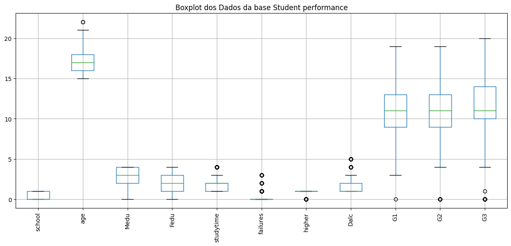

# Student Performance Prediction using Machine Learning and PSO

## Project Overview

This project compares Support Vector Machine (SVM) and Random Forest Regressor (RFR) models optimized with Particle Swarm Optimization (PSO) to predict student performance.

---

## Exploratory Data Analysis

### Correlation Matrix

  

The correlation matrix helps identify relationships between variables and highlights the strongest predictors of students' final grades.

### Distribution of Variables

  

Boxplots were used to analyze data dispersion, identify outliers, and understand the distribution of important variables.

---

## Methodology

Dataset → Preprocessing → PSO Optimization → Model Training → Evaluation → Statistical Validation

---

## Results

| Model | R² |
|---------|---------|
| Random Forest (Original Data) | 0.8566 |
| SVM (Original Data) | 0.8329 |
| SVM (Preprocessed Data) | 0.8273 |
| Random Forest (Preprocessed Data) | 0.8254 |

### Key Findings

- Random Forest achieved the highest R² score.
- SVM obtained the lowest prediction error after preprocessing.
- Preprocessing benefited SVM more than Random Forest.
- Statistical tests confirmed significant differences between configurations.

